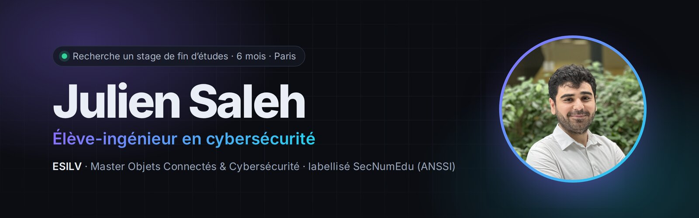
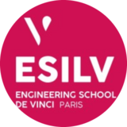
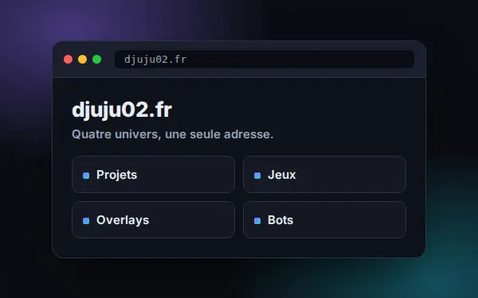
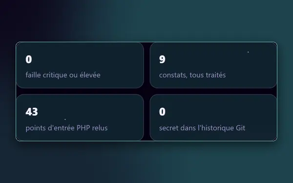
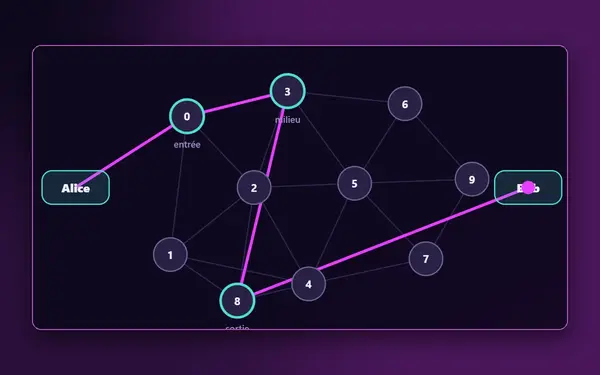
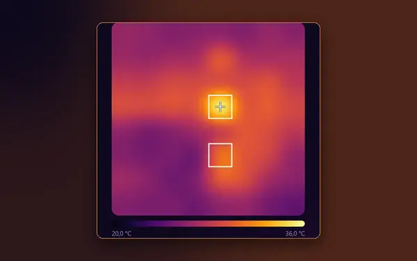
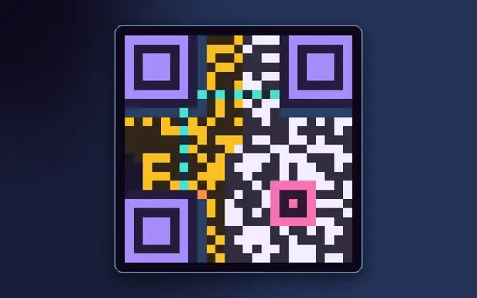
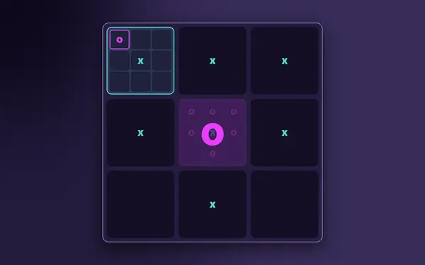
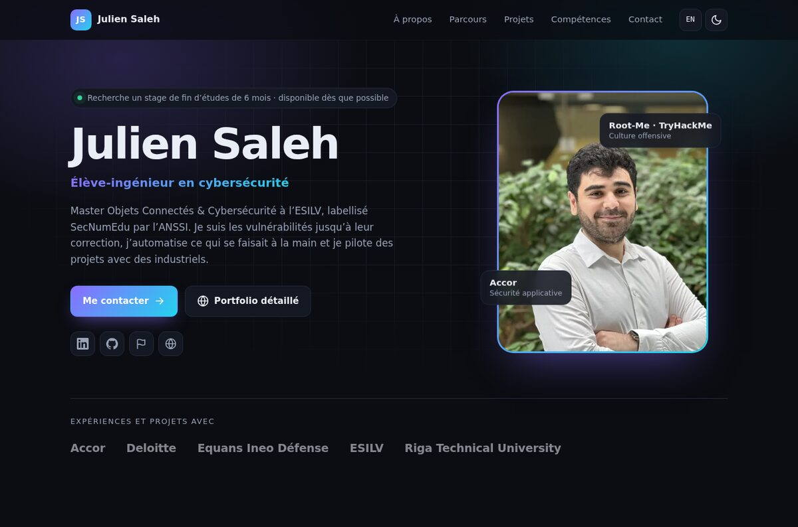
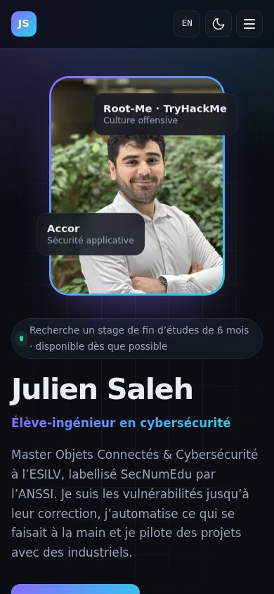

 

---

### 👋 Salut, moi c’est Julien

Je suis en dernière année à l’**ESILV**, en Master Objets Connectés & Cybersécurité.
Ce que j’aime : **suivre une faille jusqu’à sa correction**, **automatiser ce qui se faisait à la main** et **faire avancer un projet avec une équipe**.

> 🎯 **Je cherche un stage de fin d’études de 6 mois** en cybersécurité, à Paris ou en Île-de-France, dès que possible.
> Sécurité opérationnelle, DevSecOps, système ou GRC : [parlons-en](https://djuju02.fr/portfolio#contact).

### 💼 Parcours

<table>
  <tr>
    <td width="64" align="center"></td>
    <td><b>Accor</b> — Stagiaire cybersécurité, gestion des vulnérabilités Équipe Applicative Security · 2024</td>
  </tr>
  <tr>
    <td align="center">🎯</td>
    <td><b>Deloitte</b> — Chef de projet, durcissement des postes d’une équipe Red Team Projet ESILV · 2024 – 2025</td>
  </tr>
  <tr>
    <td align="center">🔌</td>
    <td><b>Equans Ineo Défense</b> — Station blanche d’analyse des clés USB Projet ESILV · 2023 – 2024</td>
  </tr>
  <tr>
    <td align="center"></td>
    <td><b>ESILV</b> — Master Objets Connectés & Cybersécurité, labellisé SecNumEdu (ANSSI) Avec un semestre à la Riga Technical University</td>
  </tr>
</table>

### 🚀 À découvrir

<table>
  <tr>
    <td width="33%" valign="top">
      
      <b><a href="https://djuju02.fr">djuju02.fr</a></b> 
      Mon site perso : projets, jeux, overlays de stream et bots.
    </td>
    <td width="33%" valign="top">
      
      <b><a href="https://djuju02.fr/portfolio/audit">Audit de mon site</a></b> 
      Audité de bout en bout, chaque point corrigé.
    </td>
    <td width="33%" valign="top">
      
      <b><a href="https://djuju02.fr/projets/routage-oignon">Routage en oignon</a></b> 
      Un mini-Tor, suivi saut par saut.
    </td>
  </tr>
  <tr>
    <td valign="top">
      
      <b><a href="https://djuju02.fr/projets/camera-thermique">Caméra thermique</a></b> 
      Un capteur infrarouge rejoué dans le navigateur.
    </td>
    <td valign="top">
      
      <b><a href="https://djuju02.fr/projets/qr-code">QR code from scratch</a></b> 
      Écrit sans bibliothèque, réparé en direct.
    </td>
    <td valign="top">
      
      <b><a href="https://djuju02.fr/jeux">Jeux contre une IA</a></b> 
      Ultimate Tic-Tac-Toe face au minimax.
    </td>
  </tr>
</table>

### 🧰 Boîte à outils

  

**Sécurité** · Burp Suite · DefectDojo · OWASP · EBIOS RM · ISO 27001 / 27005 · Root-Me · TryHackMe

### 🌱 Hors du clavier

🧗 Escalade plusieurs fois par semaine &nbsp;·&nbsp; 🎾 Tennis depuis 17 ans &nbsp;·&nbsp; 🍳 Cuisine &nbsp;·&nbsp; 🤖 Robotique & 3D &nbsp;·&nbsp; ✈️ Voyages

---

**[Visiter djuju02.github.io →](https://djuju02.github.io/)**

Envie d’échanger ? <a href="https://djuju02.fr/portfolio#contact">Formulaire de contact</a> · <a href="https://www.linkedin.com/in/juliensaleh">LinkedIn</a> · <a href="https://www.root-me.org/Djuju02">Root-Me</a>

Mettre à jour le site

Texte français dans <code>index.html</code>, traductions anglaises dans <code>i18n.js</code> (même clé <code>data-i18n</code>). Après une modification, incrémenter <code>VERSION</code> dans <code>sw.js</code>. Aperçu local : <code>python3 -m http.server 8000</code>.

